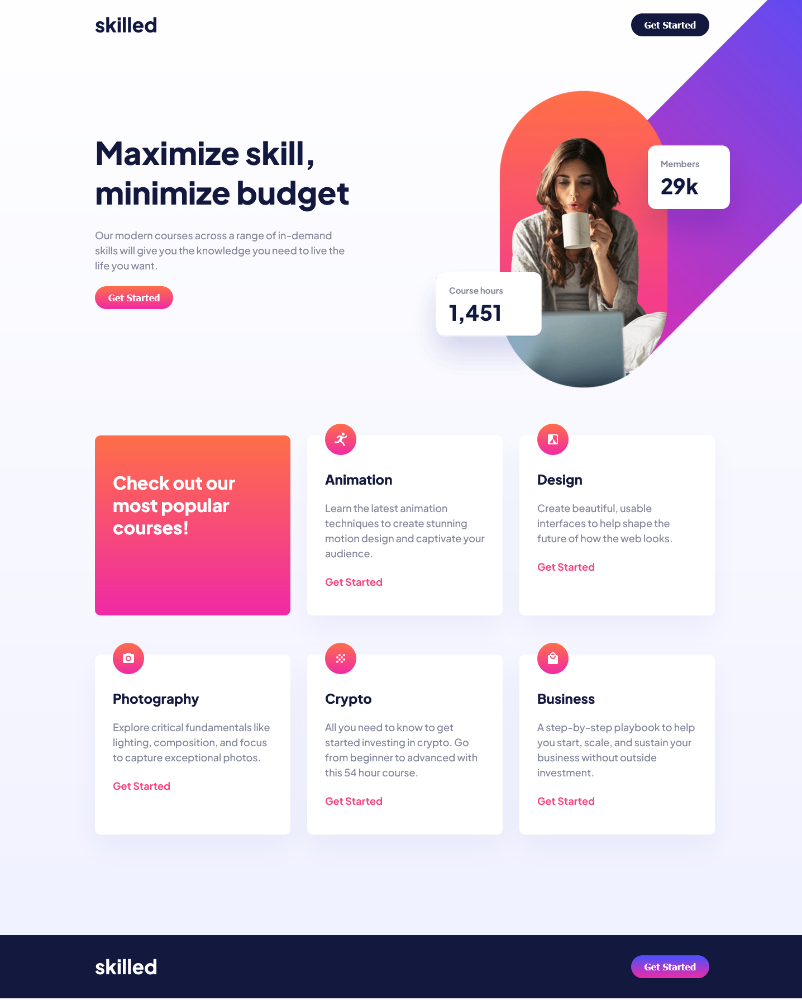

# Frontend Mentor - Skilled e-learning landing page solution

This is a solution to the [Skilled e-learning landing page challenge on Frontend Mentor](https://www.frontendmentor.io/challenges/skilled-elearning-landing-page-S1ObDrZ8q). Frontend Mentor challenges help you improve your coding skills by building realistic projects.

## Table of contents

- [Overview](#overview)
  - [The challenge](#the-challenge)
  - [Screenshot](#screenshot)
  - [Links](#links)
- [My process](#my-process)
  - [Built with](#built-with)
- [Author](#author)
- [Acknowledgments](#acknowledgments)

## Overview

### The challenge

Users should be able to:

- View the optimal layout depending on their device's screen size
- See hover states for interactive elements

### Screenshot

### Links

- Solution URL: (https://www.frontendmentor.io/solutions/skilled-elearning-landing-page-TtYkTdaIOg)
- Live Site URL: (https://gilded-pithivier-008d2f.netlify.app/)

## My process

### Built with

- Semantic HTML5 markup
- CSS custom properties
- Flexbox
- CSS Grid
- Mobile-first workflow
- SASS

## Author

- Frontend Mentor - [@JGedd](https://www.frontendmentor.io/profile/JGedd)
- Twitter - [@John_geddis](https://www.frontendmentor.io/profile/JGedd)

## Acknowledgments

I would like to give a big thanks to @GitDoppler their solution helped solve the issue of the hero image overflowing, by using position-relative on the parent, position-absolute on the image and overflow-x:hidden on the html+body.
